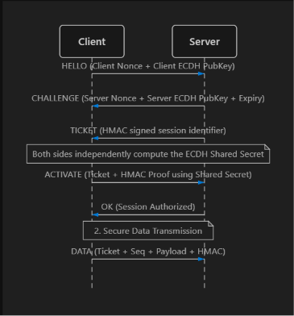

# VTP/1 — Verified Ticket Protocol
    

VTP/1 is a lightweight, highly secure, custom transport protocol built on top of TCP. It is designed to demonstrate and implement production-grade security mechanisms used by real-world distributed systems to protect against **replay attacks, packet tampering, eavesdropping, and session abuse.**

The protocol features a robust handshake mechanism, ephemeral key exchanges, and distributed session management capable of handling high-concurrency environments.

## Key Security Features
- **TLS Encryption (Transport Security)**: All raw TCP sockets are wrapped in TLS, ensuring that traffic cannot be eavesdropped or modified in transit.
- **ECDH Forward Secrecy**: Uses Ephemeral Elliptic Curve Diffie-Hellman (SECP256R1) during the handshake. Even if the server's master secret is compromised in the future, past captured traffic cannot be decrypted.
- **HMAC-SHA256 Authenticated Messaging**: Every data packet is signed using a session-specific derived key, ensuring strict message integrity.
- **Strict Sequence Numbers**: Enforces an incremental sequence counter on every message to categorically reject replay attacks and out-of-order packets.
- **Ticket-based Sessions**: Instead of sending authentication credentials with every request, clients are issued temporary cryptographic "Tickets" (similar to session cookies or Kerberos tickets).
- **Persistent Distributed State**: Uses asynchronous Redis (redis.asyncio) to store pending and active session tickets, allowing the server to scale horizontally across multiple instances without losing active handshakes or sessions.

## Folder Layout

    vtp-protocol/
    ├── README.md
    ├── LICENSE
    ├── requirements.txt
    ├── src/
    │ ├── common/
    │ │ ├── crypto.py         # ECDH derivations and HMAC helpers
    │ │ ├── framing.py        # TCP packet length-prefixing and JSON parsing
    │ │ ├── net.py            # Trusted source check
    │ │ └── config.py         # Secrets, TTLs, and Global settings
    │ ├── server/
    │ │ ├── redis_store.py    # Asynchronous Redis session state manager
    │ │ ├── rate_limiter.py   # token rate limit manager
    │ │ ├── handlers.py       # Protocol state machine (HELLO, ACTIVATE, DATA)
    │ │ └── server.py         # Asyncio TLS TCP Server entrypoint
    │ ├── client/
    │ │ └── client.py         # VTP client side implementation
    │ └── main.py             # CLI (Command Line Interface) runner
    └── tests/
      ├── replay_test.py
      ├── injection_test.py
      └── load_test.py
    


## How the Protocol Works (Simple View)

1. Client says hello  
2. Server sends a challenge and a ticket  
3. Client proves it owns the session key  
4. Server allows secure messages  
5. Every message must increase a counter  

If a message is:
- Old  
- Changed  
- Or out of order  

The server ignores it.

```
Client → Server: HELLO
Server → Client: CHALLENGE
Server → Client: TICKET
Client → Server: ACTIVATE
Server → Client: OK
Client → Server: DATA (seq, mac)
```



#### If a message is old, changed in transit, out of order, or has an invalid HMAC, the server silently drops the packet or forcibly closes the connection.


## Running the Project

### Requirements
- **Python 3.11+**
- **Redis server** running locally or remotely (defaults to redis://localhost).
- **OpenSSL** (to generate local testing certificates).

### Install Dependencies

    pip install -r requirements.txt

### Generate TLS Certificates

You need a self-signed certificate for the local TLS server to work:

``` bash
openssl req -x509 -newkey rsa:4096 -keyout server.key -out server.crt -days 365 -nodes -subj "/CN=localhost"    
```

### Start the server

Start your local Redis instance, then run:

```bash
# Optional: Set custom secrets and Redis URL
export VTP_SERVER_SECRET="your_super_secret_master_key_here"
export REDIS_URL="redis://localhost:6379"
python src/main.py server
```

### Start the client

In a seperate terminal window
```bash
    python src/main.py --mode client
```
You should see the client perform the ECDH handshake, retrieve a ticket, and securely transmit data frames to the server.


## Limitations & Next Improvements

- **No Client Certificate Authentication (mTLS):** Currently relies entirely on ticket-based application-layer auth.
- **Web UI Dashboard:** Adding a FastAPI WebSocket bridge to visualize active sessions, ECDH key exchanges, and real-time message payloads in the browser.
- **Protocol Versioning Handling:** Adding robust fallback mechanisms for older V=0 protocol versions.


## License


MIT License
